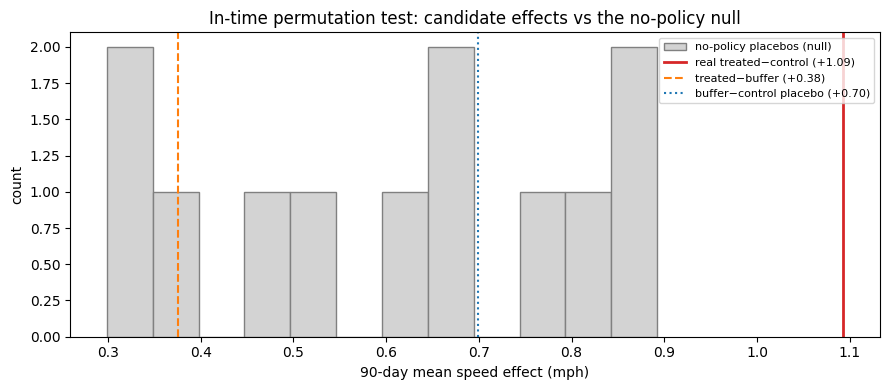
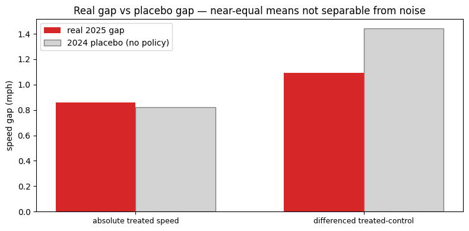
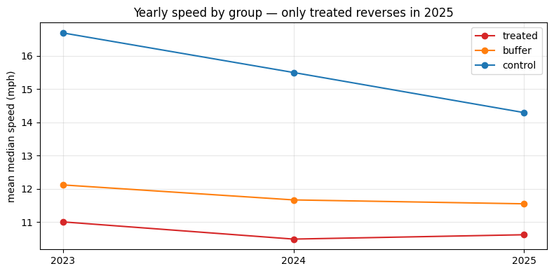
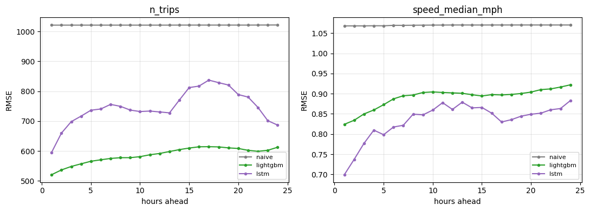

# NYC Congestion Pricing — A Counterfactual Investigation of Taxi Speeds & Volumes

**Did New York City's Congestion Relief Zone (CRZ) speed up taxis inside the cordon, and did it suppress demand?**
This project builds an hourly counterfactual for Manhattan's congestion-pricing zone from open data, then puts
the result through a battery of falsification tests. The headline: **the speed effect is *not robustly
separable* from divergent group trends**, and a single rigorous-looking test would have reported a false positive
that the placebos caught. What survives are clean *descriptive* findings and a no-demand-suppression result.

> The contribution here is methodological discipline, not a headline number. Most of the work is in *not*
> reporting an effect the data can't support.

---

## The question and the design

NYC began charging a per-trip CRZ fee (≈$0.75 yellow / $1.50 FHV) for trips touching Manhattan south of and
including 60th St on **5 January 2025**. Using NYC TLC yellow-taxi records, I split every hour of trips into three
groups and estimate what the zone *would* have done absent the policy:

- **treated** - trips touching the CRZ (Manhattan ≤ 60th St)
- **buffer** - trips touching the ring of zones immediately outside the cordon (fee-avoidance displacement probe)
- **control** - trips entirely outside both

The CRZ zone set is the **official MTA list**; the buffer ring is derived **geometrically** (zones within 100 ft of
the cordon, from the TLC zone GeoParquet), so neither relies on hand-picking.

## Key results

| Question | Result | Verdict |
|---|---|---|
| Speed relief in zone | treated−control +1.09, treated−buffer +0.38, untreated placebo +0.70 mph | **not robustly separable** - comparison-group dependent |
| Demand suppression | treated volume **+13.5% YoY** (rose) | **no suppression** (qualitative) |
| Speed trajectory | treated is the **only** group whose speed reversed upward in 2025 | robust descriptive difference |
| Forecasting: LSTM vs LightGBM | GBM best overall; LSTM wins speed **only at short horizon** | GBM preferred at hourly aggregation |

### The falsification suite (the centrepiece)

An in-time permutation test (fake interventions across the pre-period) gives a no-policy **null** that is itself
*positive and trending* (mean ≈ +0.60 mph). The real treated−control effect (+1.09) exceeds that null at p ≈ 0.000
— but this is **confounded**: the real window is the latest point on an *accelerating* differential trend, so it is
the expected extremum under the null even with no policy (permutation exchangeability fails). The decisive check is
that the cleaner **treated−buffer** estimate (+0.38) is *smaller* than the **buffer−control** placebo (+0.70)
between two untreated groups.

## Data (all keyless, no API keys, no registration)

| Source | Use | Licence |
|---|---|---|
| [NYC TLC trip records](https://www.nyc.gov/site/tlc/about/tlc-trip-record-data.page) | hourly volume / speed | CC BY 4.0 |
| [MTA Central Business District Taxi Zones](https://data.ny.gov/d/yfdc-w5jh) | official CRZ zone set | open |
| TLC taxi-zone GeoParquet (`source.coop/cholmes/nyc-taxi-zones`) | buffer-ring geometry | open |
| [Open-Meteo archive](https://open-meteo.com/) | weather covariates | free (non-commercial) |

## Running the code

Built for **Google Colab (free tier)**; cold-start reproducible, any user can run from scratch.

1. Open the notebooks in order (`step1` → `step7`).
2. Each caches small artifacts to a Drive folder (`nyc-crz-counterfactual/`); the raw monthly TLC files are
   downloaded one at a time, aggregated, and deleted, so peak disk stays small.
3. The 3-group panel rebuild (step 1) is ~3 minutes; everything downstream reads the cached panel.

## Limitations

- **Two pre-policy years** isn't enough to separate the policy from each group's own (non-linear, accelerating)
  speed trend; the effect estimate swings with the comparison group.
- Trips are flagged by **zone**, so the FDR Drive / West Side Highway through-traffic exemptions can't be modelled.
- The **control** group's speed decline is partly endogenous to its own exogenous +39.8% volume surge, making it a
  poor counterfactual; **buffer** is cleaner but the effect against it is within the spurious range.
- In-time permutation tests assume **exchangeability**, which a monotonic trend violates, documented here as a live
  failure mode, not assumed away.

## Attribution

Contains information from NYC TLC and MTA open data. Weather © Open-Meteo. See `LICENSE` (MIT) for the code.
